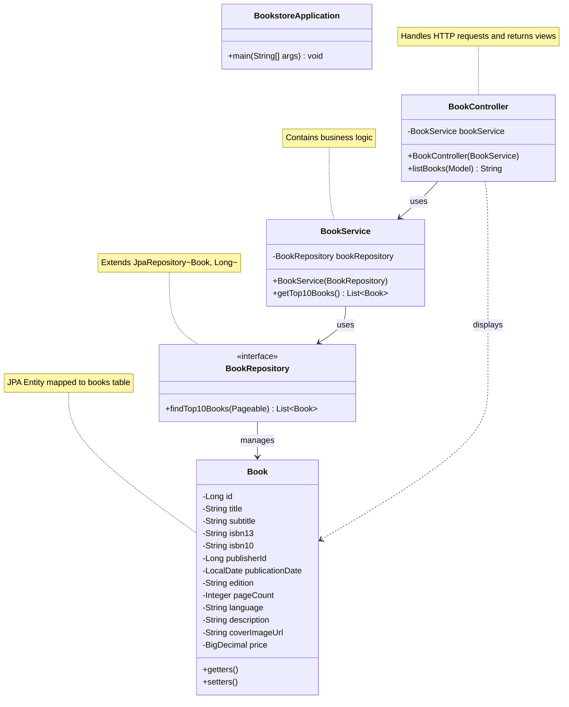
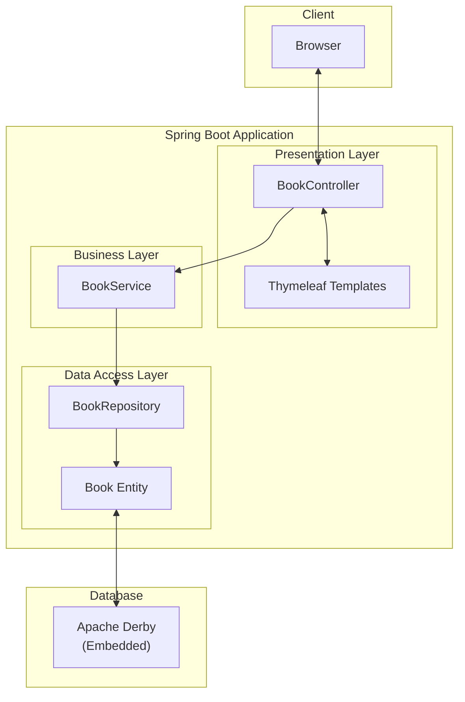
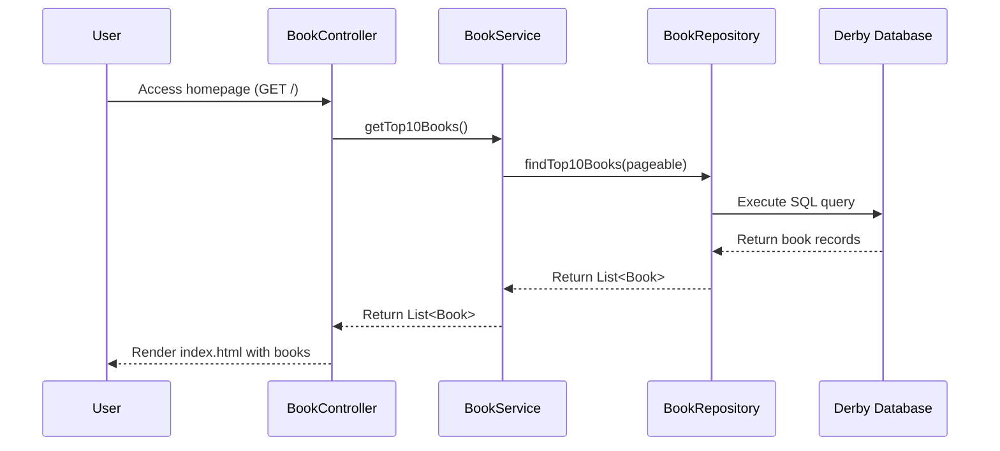

# Bookstore Application Architecture

This document provides an overview of the architecture of the Bookstore application, which displays the top 10 books.

## Architecture Overview

The application follows a standard Spring Boot architecture with the following layers:
- **Presentation Layer**: Controllers and Thymeleaf templates
- **Business Logic Layer**: Services
- **Data Access Layer**: Repositories and JPA entities
- **Database**: Apache Derby (embedded)

## Class Diagram

## Component Diagram

## Sequence Diagram for Retrieving Books

## Technology Stack

- **Java**: Programming language
- **Spring Boot**: Application framework
- **Spring Web**: Web layer
- **Spring Data JPA**: Data access layer
- **Hibernate**: JPA implementation
- **Apache Derby**: Embedded database
- **Thymeleaf**: View templating
- **Maven**: Dependency management and build tool
- **JUnit 5 & Spring Boot Test**: Testing framework
