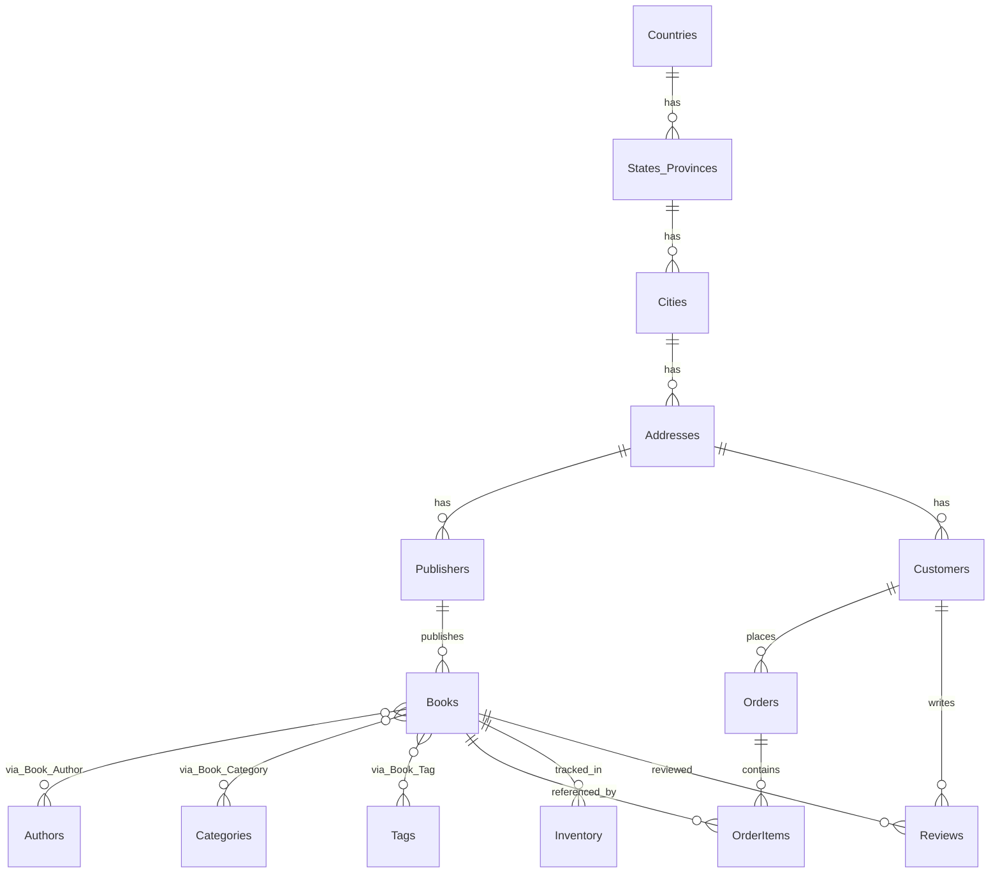

# Bookstore Database Schema

This document outlines the normalized database schema for a bookstore application. The schema is designed to efficiently store and retrieve information about books, authors, publishers, customers, orders, and related entities.

## Entity Relationship Diagram

## Tables

### Location Tables

#### Countries
| Column | Type | Constraints | Description |
|--------|------|-------------|-------------|
| id | INT | PRIMARY KEY, AUTO_INCREMENT | Unique identifier |
| name | VARCHAR(100) | NOT NULL, UNIQUE | Country name |
| code | VARCHAR(3) | NOT NULL, UNIQUE | ISO country code |

#### States
| Column | Type | Constraints | Description |
|--------|------|-------------|-------------|
| id | INT | PRIMARY KEY, AUTO_INCREMENT | Unique identifier |
| name | VARCHAR(100) | NOT NULL | State/province name |
| code | VARCHAR(10) | NOT NULL | State/province code |
| country_id | INT | FOREIGN KEY (Countries.id), NOT NULL | Reference to country |
| UNIQUE(name, country_id) | | | Ensures state names are unique within a country |

#### Cities
| Column | Type | Constraints | Description |
|--------|------|-------------|-------------|
| id | INT | PRIMARY KEY, AUTO_INCREMENT | Unique identifier |
| name | VARCHAR(100) | NOT NULL | City name |
| state_id | INT | FOREIGN KEY (States.id), NOT NULL | Reference to state |
| postal_code | VARCHAR(20) | | Postal/ZIP code |
| UNIQUE(name, state_id, postal_code) | | | Ensures city entries are unique |

#### Addresses
| Column | Type | Constraints | Description |
|--------|------|-------------|-------------|
| id | INT | PRIMARY KEY, AUTO_INCREMENT | Unique identifier |
| street_line1 | VARCHAR(255) | NOT NULL | Primary address line |
| street_line2 | VARCHAR(255) | | Secondary address line |
| city_id | INT | FOREIGN KEY (Cities.id), NOT NULL | Reference to city |

### Core Entities

#### Authors
| Column | Type | Constraints | Description |
|--------|------|-------------|-------------|
| id | INT | PRIMARY KEY, AUTO_INCREMENT | Unique identifier |
| first_name | VARCHAR(100) | NOT NULL | Author's first name |
| last_name | VARCHAR(100) | NOT NULL | Author's last name |
| biography | TEXT | | Author's biographical information |
| birth_date | DATE | | Author's date of birth |

#### Publishers
| Column | Type | Constraints | Description |
|--------|------|-------------|-------------|
| id | INT | PRIMARY KEY, AUTO_INCREMENT | Unique identifier |
| name | VARCHAR(255) | NOT NULL, UNIQUE | Publisher name |
| address_id | INT | FOREIGN KEY (Addresses.id) | Publisher's address |
| website | VARCHAR(255) | | Publisher's website URL |
| email | VARCHAR(100) | | Publisher's contact email |
| phone | VARCHAR(20) | | Publisher's contact phone |

#### Categories
| Column | Type | Constraints | Description |
|--------|------|-------------|-------------|
| id | INT | PRIMARY KEY, AUTO_INCREMENT | Unique identifier |
| name | VARCHAR(100) | NOT NULL, UNIQUE | Category name |
| description | TEXT | | Category description |
| parent_id | INT | FOREIGN KEY (Categories.id) | Parent category (for hierarchical categories) |

#### Tags
| Column | Type | Constraints | Description |
|--------|------|-------------|-------------|
| id | INT | PRIMARY KEY, AUTO_INCREMENT | Unique identifier |
| name | VARCHAR(50) | NOT NULL, UNIQUE | Tag name |

#### Books
| Column | Type | Constraints | Description |
|--------|------|-------------|-------------|
| id | INT | PRIMARY KEY, AUTO_INCREMENT | Unique identifier |
| title | VARCHAR(255) | NOT NULL | Book title |
| subtitle | VARCHAR(255) | | Book subtitle |
| isbn13 | VARCHAR(13) | UNIQUE | ISBN-13 number |
| isbn10 | VARCHAR(10) | UNIQUE | ISBN-10 number |
| publisher_id | INT | FOREIGN KEY (Publishers.id), NOT NULL | Reference to publisher |
| publication_date | DATE | | Publication date |
| edition | VARCHAR(50) | | Edition information |
| page_count | INT | | Number of pages |
| language | VARCHAR(50) | | Book language |
| description | TEXT | | Book description |
| cover_image_url | VARCHAR(255) | | URL to cover image |
| price | DECIMAL(10,2) | NOT NULL | List price |

#### Book_Author (Junction Table)
| Column | Type | Constraints | Description |
|--------|------|-------------|-------------|
| book_id | INT | FOREIGN KEY (Books.id), PRIMARY KEY | Reference to book |
| author_id | INT | FOREIGN KEY (Authors.id), PRIMARY KEY | Reference to author |
| author_order | INT | NOT NULL | Order of authors for the book |

#### Book_Category (Junction Table)
| Column | Type | Constraints | Description |
|--------|------|-------------|-------------|
| book_id | INT | FOREIGN KEY (Books.id), PRIMARY KEY | Reference to book |
| category_id | INT | FOREIGN KEY (Categories.id), PRIMARY KEY | Reference to category |

#### Book_Tag (Junction Table)
| Column | Type | Constraints | Description |
|--------|------|-------------|-------------|
| book_id | INT | FOREIGN KEY (Books.id), PRIMARY KEY | Reference to book |
| tag_id | INT | FOREIGN KEY (Tags.id), PRIMARY KEY | Reference to tag |

### Inventory and Sales

#### Inventory
| Column | Type | Constraints | Description |
|--------|------|-------------|-------------|
| id | INT | PRIMARY KEY, AUTO_INCREMENT | Unique identifier |
| book_id | INT | FOREIGN KEY (Books.id), NOT NULL | Reference to book |
| quantity | INT | NOT NULL, DEFAULT 0 | Current stock quantity |
| location | VARCHAR(100) | | Storage location |
| last_updated | TIMESTAMP | NOT NULL, DEFAULT CURRENT_TIMESTAMP | Last inventory update |

#### Customers
| Column | Type | Constraints | Description |
|--------|------|-------------|-------------|
| id | INT | PRIMARY KEY, AUTO_INCREMENT | Unique identifier |
| first_name | VARCHAR(100) | NOT NULL | Customer's first name |
| last_name | VARCHAR(100) | NOT NULL | Customer's last name |
| email | VARCHAR(100) | NOT NULL, UNIQUE | Customer's email address |
| phone | VARCHAR(20) | | Customer's phone number |
| address_id | INT | FOREIGN KEY (Addresses.id) | Customer's address |
| registration_date | TIMESTAMP | NOT NULL, DEFAULT CURRENT_TIMESTAMP | Account creation date |

#### Orders
| Column | Type | Constraints | Description |
|--------|------|-------------|-------------|
| id | INT | PRIMARY KEY, AUTO_INCREMENT | Unique identifier |
| customer_id | INT | FOREIGN KEY (Customers.id), NOT NULL | Reference to customer |
| order_date | TIMESTAMP | NOT NULL, DEFAULT CURRENT_TIMESTAMP | Date order was placed |
| status | VARCHAR(20) | NOT NULL | Order status (e.g., pending, shipped) |
| shipping_address_id | INT | FOREIGN KEY (Addresses.id), NOT NULL | Shipping address |
| billing_address_id | INT | FOREIGN KEY (Addresses.id), NOT NULL | Billing address |
| shipping_method | VARCHAR(50) | | Shipping method used |
| tracking_number | VARCHAR(100) | | Shipping tracking number |
| total_amount | DECIMAL(10,2) | NOT NULL | Total order amount |
| payment_method | VARCHAR(50) | NOT NULL | Payment method used |
| payment_status | VARCHAR(20) | NOT NULL | Payment status |

#### OrderItems
| Column | Type | Constraints | Description |
|--------|------|-------------|-------------|
| id | INT | PRIMARY KEY, AUTO_INCREMENT | Unique identifier |
| order_id | INT | FOREIGN KEY (Orders.id), NOT NULL | Reference to order |
| book_id | INT | FOREIGN KEY (Books.id), NOT NULL | Reference to book |
| quantity | INT | NOT NULL | Quantity ordered |
| unit_price | DECIMAL(10,2) | NOT NULL | Price at time of purchase |
| discount | DECIMAL(10,2) | DEFAULT 0 | Discount amount |
| subtotal | DECIMAL(10,2) | NOT NULL | Total for this item |

### User Engagement

#### Reviews
| Column | Type | Constraints | Description |
|--------|------|-------------|-------------|
| id | INT | PRIMARY KEY, AUTO_INCREMENT | Unique identifier |
| book_id | INT | FOREIGN KEY (Books.id), NOT NULL | Reference to book |
| customer_id | INT | FOREIGN KEY (Customers.id), NOT NULL | Reference to customer |
| rating | INT | NOT NULL, CHECK (rating BETWEEN 1 AND 5) | Rating (1-5 stars) |
| review_text | TEXT | | Review content |
| review_date | TIMESTAMP | NOT NULL, DEFAULT CURRENT_TIMESTAMP | Date of review |
| UNIQUE(book_id, customer_id) | | | One review per book per customer |

## Indexes

- Books: CREATE INDEX idx_books_title ON Books(title);
- Books: CREATE INDEX idx_books_publication_date ON Books(publication_date);
- Authors: CREATE INDEX idx_authors_last_name ON Authors(last_name);
- Orders: CREATE INDEX idx_orders_customer_id ON Orders(customer_id);
- Orders: CREATE INDEX idx_orders_order_date ON Orders(order_date);
- OrderItems: CREATE INDEX idx_order_items_order_id ON OrderItems(order_id);
- OrderItems: CREATE INDEX idx_order_items_book_id ON OrderItems(book_id);
- Reviews: CREATE INDEX idx_reviews_book_id ON Reviews(book_id);

## Notes on Normalization

1. **First Normal Form (1NF)**: All tables have a primary key, and all columns contain atomic values.

2. **Second Normal Form (2NF)**: All non-key attributes are fully dependent on the primary key. Junction tables (Book_Author, Book_Category, Book_Tag) handle many-to-many relationships.

3. **Third Normal Form (3NF)**: All attributes are directly dependent on the primary key and not on other non-key attributes. For example:
   - Location data is normalized into Countries, States, Cities, and Addresses tables
   - Book metadata is separated from inventory information
   - Customer information is separated from order details

4. **Fourth Normal Form (4NF)**: Multi-valued dependencies are handled through junction tables.

5. **Fifth Normal Form (5NF)**: Join dependencies are properly decomposed, ensuring that tables can be reconstructed without loss of information.

This schema provides a solid foundation for a bookstore application while maintaining data integrity and minimizing redundancy.